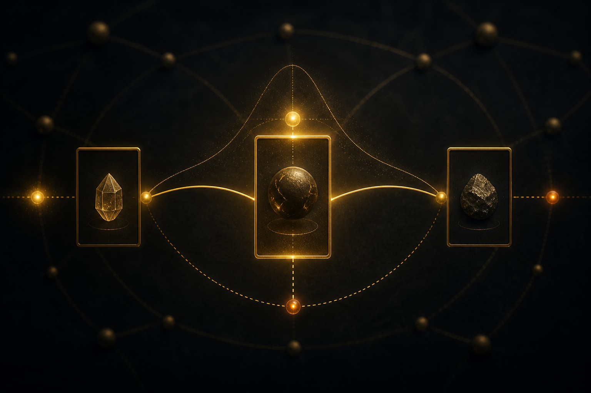

# Quinovo

An **operational ontology**. Typed objects, named links, inference, and governed actions. Agents talk to it over MCP. They may only `apply_action`. They may not `PATCH` a row or run SQL.

You bring the world as a **pack**. The engine does not know your nouns.


[](docs/demo.mp4)

[Watch the demo (mp4)](docs/demo.mp4)

## Four primitives

If any one is missing, you built something else.

| Primitive | Job | If missing, you built |
|-----------|-----|------------------------|
| **Data** | Objects, properties, named links, series | A wiki |
| **Logic** | Rules, functions, forecasts, inference | Pretty CRUD |
| **Action** | Named transactions — the only legal writes | A read-only graph |
| **Security** | Type, row, and property, evaluated at call time | An agent with root |


## How a write happens

Objects and named links are storage. The product is **typed inference** on top: forecasts become facts, facts plus links become recommended actions, low-confidence conclusions wait for a human.




The teaching pack is a box, a buyer, and a shipper. Late forecast → `at_risk` → `notify_buyer`. Below 80% confidence the fact stays pending. `apply_action` is the only write, and it is audited.

## Run

```bash
make test
quinovo mcp --pack packs/example
quinovo init ./my-world
quinovo init --from clinic ./my-clinic
```

MCP tools are generated from the loaded pack: `list_object_types`, `get_object`, `search_around`, `filter_objects`, `list_inferred_facts`, `run_inference`, `list_actions`, `apply_action`, `get_series`, `explain_fact`.

## Packs

A pack is a domain. Quinovo is not.

| Pack | Why it exists |
|------|----------------|
| `packs/example` | Teaching world. Default for `quinovo init`. Copy it, rename the types. |
| `packs/clinic` | Honesty check: a second domain in the same binary. |

Read [docs/ontology.md](docs/ontology.md).

Apache-2.0.
